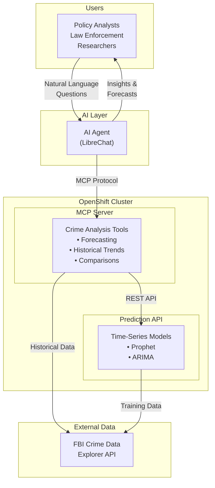

# FBI UCR Crime Analysis System - Architecture

## System Overview

## Executive Summary

The FBI UCR Crime Analysis System transforms complex FBI crime statistics into actionable intelligence through AI-powered natural language interactions. Users ask questions in plain English about crime trends and forecasts. An AI agent interprets these questions, retrieves data from the FBI's official Crime Data Explorer API, and leverages pre-trained machine learning models to generate predictions with confidence intervals.

## Key Components

| Component | Purpose |
|-----------|---------|
| Prediction API | Serves ML models for crime forecasting |
| MCP Server | Exposes crime analysis tools for AI agents |
| FBI CDE API | Official data source for crime statistics |
| OpenShift | Secure, scalable cloud platform |
